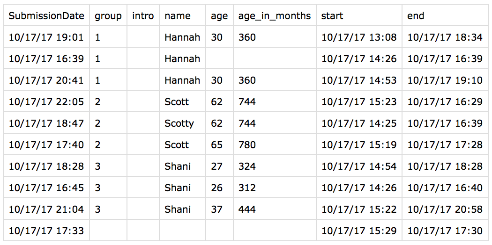

# This module 'aa' stands for Answer Agreement.

The experiment is this:

* Each member of a group records the answers from a respondent.
* All members of all groups submit their surveys to form a dataset.

This dataset is analyzed with this module.

A dataset is all submissions for a survey. A column in the dataset
should identify which submitted surveys belong to which group. The
simplest way to do this is to have a `group_id` column.

Standard use cases for analysis are take as input a dataset and
possibly a start and end column. In that case, the following analyzes:

```
>>> from aa import DatasetAgreement
>>> DatasetAgreement.from_file('df_path', 'group_column', mask_first='first', mask_last='last')
```

Another standard use case is to analyze results from an ODK dataset.
Here, an XlsForm and a dataset are used as inputs, and possibly a start
and end column. The XlsForm helps to make a mask of meaningful columns
for comparison. Use the following:

```
>>> from aa import DatasetAgreement
>>> DatasetAgreement.from_file_and_odk('df_path', 'odk_path', 'group_column', mask_first='first', mask_last='last')
```

# Command-line interface

There is also a helpful command-line interface

```
$ python3 -m aa ...
```

Asking for help with

```
$ python3 -m aa -h
```

gives

```
usage: __main__.py [-h] [-x XLSFORM] [-g GROUP_COLUMN] [-f FIRST] [-l LAST]
                   [-s]
                   datafile

Run an Answer Agreement Analysis on the command line.

positional arguments:
  datafile              A file with the data for analysis

optional arguments:
  -h, --help            show this help message and exit
  -x XLSFORM, --xlsform XLSFORM
                        The XlsForm used to create this dataset. This is
                        optional. Not all datasets come from ODK. If supplied,
                        then the XlsForm information is used to remove points
                        of comparison, such as "calculate" types.
  -g GROUP_COLUMN, --group_column GROUP_COLUMN
                        The column used to identify groups in the dataset. If
                        not supplied, then the entire dataset is treated as
                        from one group.
  -f FIRST, --first FIRST
                        The first column to start analyzing. If not supplied,
                        then the first column of the dataset is used.
  -l LAST, --last LAST  The last column to analyze. If not supplied, then the
                        last column of the dataset is used.
  -s, --separator       If option is supplied (with no argument!), then the
                        separator is switched to the hyphen "-". By default,
                        the colon ":" is used. This is only used if an ODK
                        file is passed in.
```


# Example

Take, for example, some test data [age_name_test.csv](test/data/age_name_test.csv).
Here is a screenshot of the data:



Only `name` and `age` are asked of the respondent, so that is where we do our analysis.

From the command-line:

```
$ python3 -m aa -g group -x test/data/age-name-test.xlsx -f name -l age test/data/age_name_test.csv
```

And from within Python3

```
>>> from aa import DatasetAgreement
>>> da = DatasetAgreement.from_file_and_odk('test/data/age_name_test.csv', 'test/data/age-name-test.xlsx', 'group', mask_first='name', mask_last='age')
>>> da.print_summary()
```

Both give the result of

```
*** Summary for group 1.0
- Points of comparison: 2
- Total agreement: 0.5
*** Summary for group 2.0
- Points of comparison: 2
- Total agreement: 0.0
*** Summary for group 3.0
- Points of comparison: 2
- Total agreement: 0.5
```
